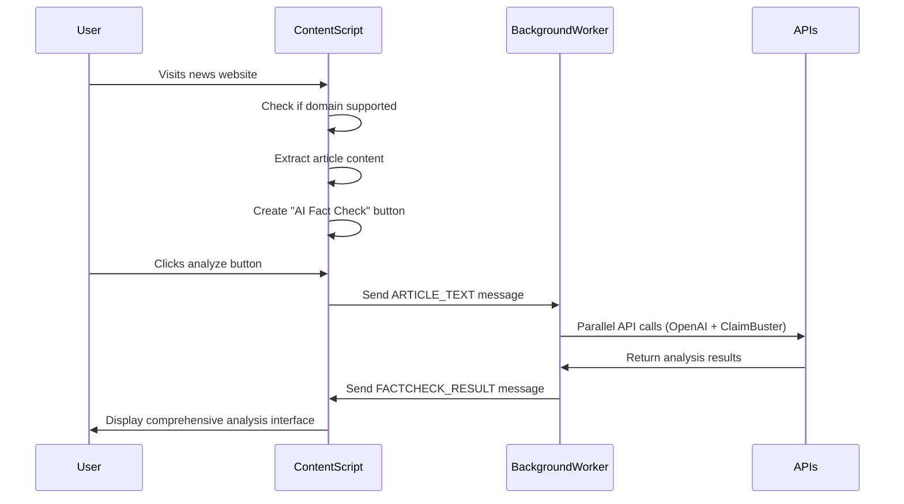
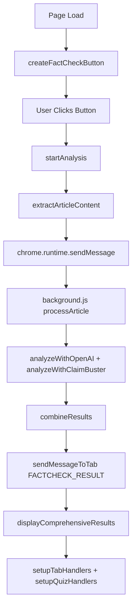

# AI Fact Checker Extension - Complete Developer Documentation

**Author & Developer:** Ibrahim Zarouri  
**Contact:** ibrahimzarouri@hotmail.com, ibrahim.zarouri@studmail.w-hs.de  
**GitHub:** https://github.com/ebooooooooo  
**Version:** 1.0  
**Last Updated:** 14.07.2025

---

## 🎯 Overview

The AI Fact Checker Extension is a sophisticated Chrome extension that provides real-time fact-checking and bias analysis for news articles. It combines OpenAI's GPT models with ClaimBuster's academic API to deliver comprehensive analysis, interactive quizzes, and reliability calibration based on real performance data.

## 🔍 Architecture Overview & Core Flow

### Phase 1: Page Load & Content Detection

When a user visits a supported news website, the following sequence occurs:



### Phase 2: Content Extraction (`content.js`)

The content script automatically detects when it's on a supported news website and begins content extraction:

```javascript
// Core content extraction logic
function extractArticleContent() {
  console.log("🔍 Starting content extraction...");

  // Multi-strategy headline extraction
  const headlineSelectors = [
    'h1',                                    // Standard H1
    '[data-testid="headline"]',              // React-based sites
    '.headline',                             // Class-based
    '.article-title',                        // Alternative class
    'header h1'                              // Header-wrapped
  ];

  let headline = '';
  for (const selector of headlineSelectors) {
    const element = document.querySelector(selector);
    if (element && element.innerText.trim().length > 10) {
      headline = element.innerText.trim();
      break;
    }
  }

  // Multi-strategy article body extraction
  const articleSelectors = [
    'article',                               // Semantic HTML5
    '[data-testid="article-body"]',          // React components
    '.article-content',                      // Common class
    '.post-content',                         // Blog posts
    'main .content'                          // Main content area
  ];

  let articleText = '';
  for (const selector of articleSelectors) {
    const element = document.querySelector(selector);
    if (element) {
      // Clean extracted text
      articleText = cleanTextContent(element.innerText);
      if (articleText.length > 200) break;   // Minimum viable content
    }
  }

  // Generate content hash for duplicate detection
  const contentHash = generateContentHash(headline + articleText);

  return {
    headline: headline,
    article: articleText,
    hash: contentHash,
    url: window.location.href,
    timestamp: Date.now()
  };
}

// Text cleaning utility
function cleanTextContent(rawText) {
  return rawText
    .replace(/\s+/g, ' ')                    // Normalize whitespace
    .replace(/\n{3,}/g, '\n\n')              // Limit line breaks
    .trim()
    .substring(0, 8000);                     // Prevent token overflow
}
```

> **Why this approach?** Different news websites use varying HTML structures. The multi-selector strategy ensures compatibility across major news sites by trying multiple common patterns.

### Phase 3: Message Passing to Background Worker

When the user clicks "Analyze Article", the content script packages the extracted data and sends it to the background worker:

```javascript
// In content.js - initiating analysis
function startAnalysis(forceNew = false) {
  console.log("🚀 Starting analysis process...");

  // Prevent duplicate analysis
  if (isAnalyzing && !forceNew) {
    console.log("Analysis already in progress, skipping");
    return;
  }

  const articleData = extractArticleContent();

  // Validation checks
  if (!articleData.headline && (!articleData.article || articleData.article.length < 50)) {
    showError('Insufficient article content found on this page');
    return;
  }

  // Check for duplicate analysis
  if (currentArticleHash === articleData.hash && hasAnalyzedCurrentPage && !forceNew) {
    console.log("Article already analyzed, showing cached results");
    return;
  }

  // Update state
  isAnalyzing = true;
  currentArticleHash = articleData.hash;

  // Send to background worker
  chrome.runtime.sendMessage({
    type: 'ARTICLE_TEXT',
    data: articleData
  }, (response) => {
    if (chrome.runtime.lastError) {
      console.error("Failed to send message:", chrome.runtime.lastError);
      showError('Failed to connect to analysis service');
      isAnalyzing = false;
    }
  });

  // Show immediate loading feedback
  showLoadingState('Analyzing article with AI...');
}
```

### Phase 4: Background Processing (`background.js`)

The background service worker receives the article data and orchestrates the dual API analysis:

```javascript
// In background.js - main message handler
chrome.runtime.onMessage.addListener((message, sender, sendResponse) => {
  console.log("📨 Background received message:", message.type);

  if (message.type === 'ARTICLE_TEXT') {
    // Send immediate acknowledgment to prevent timeout
    sendResponse({
      received: true,
      timestamp: Date.now(),
      tabId: sender.tab.id
    });

    // Process asynchronously to avoid blocking
    processArticleAsync(message.data, sender.tab.id);

    return true; // Keep message channel open
  }
});

async function processArticleAsync(articleData, tabId) {
  const { headline, article, hash } = articleData;

  try {
    console.log("🔄 Starting dual API analysis...");

    // Send progress update
    await safelySendMessageToTab(tabId, {
      type: 'FACTCHECK_UPDATE',
      status: 'analyzing',
      message: 'Analyzing with OpenAI and ClaimBuster...'
    });

    // **PARALLEL API CALLS** - This is the core efficiency gain
    const [openaiResult, claimbusterResult] = await Promise.allSettled([
      Promise.race([
        analyzeWithOpenAI({ headline, article }),
        new Promise((_, reject) =>
          setTimeout(() => reject(new Error("OpenAI timeout")), 60000)
        )
      ]),
      Promise.race([
        analyzeWithClaimBuster({ headline, article }),
        new Promise((_, reject) =>
          setTimeout(() => reject(new Error("ClaimBuster timeout")), 30000)
        )
      ])
    ]);

    // Process results
    const combinedResults = combineAnalysisResults(openaiResult, claimbusterResult, hash);

    // Send final results back to content script
    await safelySendMessageToTab(tabId, {
      type: 'FACTCHECK_RESULT',
      result: combinedResults
    });

  } catch (error) {
    console.error("❌ Analysis failed:", error);
    await safelySendMessageToTab(tabId, {
      type: 'FACTCHECK_RESULT',
      result: createErrorResponse(error, hash)
    });
  }
}
```

> **Why parallel processing?** By calling both APIs simultaneously rather than sequentially, we reduce total analysis time from ~90 seconds to ~60 seconds.

## 🧠 Core Logic & Functions

### Key Decision Points

The extension makes several critical decisions that affect user experience:

#### 1. When to Trigger Analysis (`shouldAnalyzeContent()`)

```javascript
function shouldAnalyzeContent() {
  // Check if we're on a supported domain
  const currentDomain = window.location.hostname;
  const isSupported = CONFIG.SUPPORTED_DOMAINS.some(domain =>
    currentDomain.includes(domain)
  );

  if (!isSupported) {
    console.log("❌ Domain not supported:", currentDomain);
    return false;
  }

  // Check if sufficient content exists
  const content = extractArticleContent();
  const hasContent = content.headline ||
                    (content.article && content.article.length > 200);

  if (!hasContent) {
    console.log("❌ Insufficient content found");
    return false;
  }

  // Check for duplicate analysis
  const contentHash = generateContentHash(content.headline + content.article);
  if (currentArticleHash === contentHash && hasAnalyzedCurrentPage) {
    console.log("ℹ️ Content already analyzed");
    return false;
  }

  return true;
}
```

#### 2. UI State Management (`updateUIState()`)

```javascript
function updateUIState(state, data = {}) {
  const indicator = document.getElementById('ai-fact-checker-indicator');
  const panel = document.getElementById('ai-fact-checker-results-panel');

  switch (state) {
    case 'ready':
      indicator.style.backgroundColor = '#4285f4';
      indicator.innerHTML = 'AI Fact Check';
      indicator.classList.remove('analyzing', 'completed');
      break;

    case 'analyzing':
      indicator.style.backgroundColor = '#fbbc05';
      indicator.innerHTML = '🔄 Analyzing...';
      indicator.classList.add('analyzing');
      showLoadingState(data.message || 'Analyzing with AI...');
      break;

    case 'completed':
      indicator.style.backgroundColor = getVerdictColor(data.verdict);
      indicator.innerHTML = `✓ ${data.verdict}`;
      indicator.classList.remove('analyzing');
      indicator.classList.add('completed');
      break;

    case 'error':
      indicator.style.backgroundColor = '#ea4335';
      indicator.innerHTML = '⚠️ Error';
      indicator.classList.remove('analyzing');
      showError(data.message || 'Analysis failed');
      break;
  }
}
```

#### 3. Content Hash Generation (Prevents Duplicate Analysis)

```javascript
function generateContentHash(content) {
  // Simple but effective hash function
  let hash = 0;
  if (content.length === 0) return hash.toString();

  for (let i = 0; i < content.length; i++) {
    const char = content.charCodeAt(i);
    hash = ((hash << 5) - hash) + char;
    hash = hash & hash; // Convert to 32-bit integer
  }

  return Math.abs(hash).toString(16);
}
```

### Core Function Relationships



## 🔗 API Integration & Quiz Engine

### Phase 5: OpenAI Analysis Deep Dive

The OpenAI analysis uses a sophisticated prompt system designed for comprehensive fact-checking:

```javascript
async function analyzeWithOpenAI(articleContent) {
  const { headline, article } = articleContent;
  const fullText = headline ? `Headline: ${headline}\n\nArticle: ${article}` : article;

  // Language detection for appropriate response
  const isGerman = /[äöüß]/.test(fullText) ||
                  /\b(der|die|das|und|ist|ein|eine|von|zu|auf|mit)\b/i.test(fullText);

  // Truncate to prevent token overflow
  const processedText = fullText.length > CONFIG.MAX_ARTICLE_LENGTH
    ? fullText.substring(0, CONFIG.MAX_ARTICLE_LENGTH) + '...'
    : fullText;

  const comprehensivePrompt = `You are an expert fact-checker, misinformation analyst, and media watchdog.

Respond in ${isGerman ? 'GERMAN' : 'ENGLISH'}.

Analyze this news article comprehensively across these PRIMARY ANALYSIS AREAS:

1. FACTUAL ACCURACY
   - Verify specific claims, statistics, and statements
   - Check for fabricated or distorted information
   - Identify unsupported assertions

2. BIAS & MANIPULATION DETECTION
   - Inflammatory Language: Detect sensationalist, emotionally charged words
   - Framing Bias: How the story is presented vs. alternative framings
   - Selection Bias: What information is emphasized vs. omitted
   - Dog-whistle Politics: Coded language targeting specific groups

3. HEADLINE ANALYSIS
   - Compare headline accuracy to actual content
   - Identify clickbait, sensationalism, or misleading framing
   - Check if headline misrepresents the story's nuance

4. WRITING STYLE & TONE ASSESSMENT
   - Emotional Manipulation: Use of fear, anger, disgust to influence readers
   - Loaded Language: Words chosen to bias rather than inform
   - Political Messaging: Underlying ideological agenda

5. SOURCE CREDIBILITY
   - Evaluate quoted sources and their reliability
   - Check for anonymous sources without justification
   - Assess primary vs. secondary source usage

6. COMPREHENSION QUIZ GENERATION
   - Create 5 multiple-choice questions testing key facts and themes
   - Include 4 options per question with explanations
   - Focus on media literacy and critical thinking

ARTICLE:
------
${processedText}
------

Return ONLY valid JSON matching this exact schema:
{
  "overall_verdict": "${isGerman ? 'ZUVERLÄSSIG|FRAGWÜRDIG|IRREFÜHREND|FALSCH' : 'RELIABLE|QUESTIONABLE|MISLEADING|FALSE'}",
  "confidence_score": 85,
  "summary": "${isGerman ? 'Kurze Zusammenfassung' : 'Brief summary'}",
  "detailed_analysis": "${isGerman ? 'Detaillierte Analyse' : 'Detailed analysis'}",
  "red_flags": ["${isGerman ? 'Problematische Elemente' : 'Concerning elements'}"],
  "sources_needed": ["${isGerman ? 'Benötigte Quellen' : 'Needed sources'}"],

  "headline_analysis": {
    "accuracy_vs_content": "${isGerman ? 'Überschrift vs. Inhalt' : 'Headline vs content accuracy'}",
    "sensationalism_level": "LOW|MEDIUM|HIGH",
    "inflammatory_language": ["${isGerman ? 'Reizende Begriffe' : 'Inflammatory terms'}"]
  },

  "bias_analysis": {
    "type_of_bias": ["SELECTION|FRAMING|PARTISAN"],
    "bias_direction": "${isGerman ? 'LINKS|RECHTS|NEUTRAL' : 'LEFT|RIGHT|NEUTRAL'}",
    "manipulation_techniques": ["${isGerman ? 'Techniken' : 'Techniques used'}"]
  },

  "key_claims": [
    {
      "claim": "${isGerman ? 'Spezifische Aussage' : 'Specific claim'}",
      "verdict": "${isGerman ? 'WAHR|FALSCH|UNBESTÄTIGT' : 'TRUE|FALSE|UNVERIFIED'}",
      "explanation": "${isGerman ? 'Erklärung' : 'Why this matters'}"
    }
  ],

  "comprehension_quiz": {
    "questions": [
      {
        "id": 1,
        "question": "${isGerman ? 'Frage zum Hauptthema' : 'Question about main theme'}",
        "type": "factual|comprehension|analysis|application",
        "options": {
          "A": "Option A text",
          "B": "Option B text",
          "C": "Option C text",
          "D": "Option D text"
        },
        "correct_answer": "B",
        "explanation": "${isGerman ? 'Erklärung der richtigen Antwort' : 'Why this answer is correct'}"
      }
    ]
  }
}`;

  // Make API request with timeout protection
  const response = await fetch(CONFIG.OPENAI_API_URL, {
    method: 'POST',
    headers: {
      'Content-Type': 'application/json',
      'Authorization': `Bearer ${API_KEYS.OPENAI_API_KEY}`
    },
    body: JSON.stringify({
      model: CONFIG.MODEL,           // 'gpt-4.1-nano'
      messages: [
        {
          role: 'system',
          content: `You are an expert fact-checker. Always respond with valid JSON only. ${isGerman ? 'Analyze in German.' : 'Analyze in English.'}`
        },
        {
          role: 'user',
          content: comprehensivePrompt
        }
      ],
      max_tokens: CONFIG.MAX_TOKENS,  // 4000
      temperature: CONFIG.TEMPERATURE // 0.2 for factual consistency
    })
  });

  return processOpenAIResponse(await response.json());
}
```

> **Why this prompt structure?** The prompt is designed to:
> - Standardize output format with strict JSON schema
> - Cover multiple analysis dimensions beyond just fact-checking
> - Generate educational content (quiz questions) to improve media literacy
> - Adapt to language for German and English articles
> - Provide actionable insights rather than just verdicts

### Phase 6: ClaimBuster Integration

ClaimBuster provides academic-grade, sentence-level claim verification:

```javascript
async function analyzeWithClaimBuster(articleContent) {
  const { headline, article } = articleContent;
  const fullText = headline ? `${headline}\n\n${article}` : article;

  if (!fullText || fullText.length < 50) {
    return { success: false, error: 'Insufficient content for ClaimBuster' };
  }

  console.log('🔬 Starting ClaimBuster sentence analysis...');

  // **INTELLIGENT SENTENCE SPLITTING**
  const sentences = splitTextIntoSentences(fullText);

  // **SMART CONTENT FILTERING** - Focus on claim-relevant sentences
  let sentencesToAnalyze;
  if (sentences.length <= 10) {
    // Short articles: analyze everything
    sentencesToAnalyze = sentences;
  } else if (sentences.length <= 20) {
    // Medium articles: first 15 sentences
    sentencesToAnalyze = sentences.slice(0, 15);
  } else {
    // Long articles: filter for claim-heavy sentences then take top 25
    const claimKeywords = [
      // English
      'according to', 'claim', 'said', 'states', 'reports', 'announced',
      'million', 'billion', 'percent', '%', 'study', 'research',
      // German
      'laut', 'gemäß', 'behauptet', 'sagte', 'erklärt', 'prozent',
      'millionen', 'milliarden', 'studie', 'forscher'
    ];

    const claimRelevantSentences = sentences.filter(sentence => {
      const lower = sentence.toLowerCase();
      return claimKeywords.some(keyword => lower.includes(keyword)) ||
             /\d+%|\d+\s+percent|\d+\s+million|\d+\s+billion/.test(sentence) ||
             sentence.includes('"') || sentence.includes('„');
    });

    sentencesToAnalyze = claimRelevantSentences.length >= 3
      ? claimRelevantSentences.slice(0, 25)
      : sentences.slice(0, 10);
  }

  console.log(`Analyzing ${sentencesToAnalyze.length} sentences out of ${sentences.length} total`);

  // **PARALLEL SENTENCE ANALYSIS**
  const sentencePromises = sentencesToAnalyze.map(async (sentence, index) => {
    try {
      const response = await fetch(CONFIG.CLAIMBUSTER_API_URL, {
        method: 'POST',
        headers: {
          'x-api-key': API_KEYS.CLAIMBUSTER_API_KEY,
          'Content-Type': 'application/json'
        },
        body: JSON.stringify({
          input_text: sentence.trim()
        })
      });

      if (!response.ok) return null;

      const data = await response.json();
      return {
        sentence: sentence.trim(),
        score: data.results?.[0]?.score || 0,
        index: index
      };
    } catch (error) {
      console.warn(`ClaimBuster error for sentence ${index}:`, error);
      return null;
    }
  });

  const results = await Promise.allSettled(sentencePromises);
  const validResults = results
    .filter(r => r.status === 'fulfilled' && r.value !== null)
    .map(r => r.value);

  return {
    success: true,
    analysis: processClaimBusterResults(validResults, sentences.length)
  };
}
```

#### ClaimBuster Response Structure:

```json
{
  "success": true,
  "analysis": {
    "overall_score": 0.75,
    "priority": "HIGH|MEDIUM|LOW|MINIMAL",
    "quality_claims": [
      {
        "sentence": "The study found 85% of participants improved.",
        "score": 0.82,
        "index": 3
      }
    ],
    "summary": "3 high-quality claims require fact-checking verification",
    "total_sentences_in_article": 45,
    "analyzed_sentences": 25,
    "quality_claims_count": 3,
    "average_score": 0.67,
    "highest_score": 0.82
  }
}
```

## 🔧 Prompt Customization & Response Variability

### Customizable Analysis Prompts

One of the most powerful features of the extension is the customizable prompt system in `background.js`. By modifying the comprehensive prompt, developers and users can dramatically change the analysis focus and quiz generation.

#### Location of the Main Prompt

In `background.js`, around line 400-600, you'll find the main analysis prompt:

```javascript
const comprehensivePrompt = `You are an expert fact-checker, misinformation analyst, and media watchdog.

Respond in ${isGerman ? 'GERMAN' : 'ENGLISH'}.

Analyze this news article comprehensively across these PRIMARY ANALYSIS AREAS:

1. FACTUAL ACCURACY
   - Verify specific claims, statistics, and statements
   - Check for fabricated or distorted information
   - Identify unsupported assertions

2. BIAS & MANIPULATION DETECTION
   - Inflammatory Language: Detect sensationalist, emotionally charged words
   - Framing Bias: How the story is presented vs. alternative framings
   - Selection Bias: What information is emphasized vs. omitted
   - Dog-whistle Politics: Coded language targeting specific groups

// ... rest of prompt
`;
```

### How Prompt Changes Affect the Entire Extension

#### 1. Analysis Focus Customization

**Example Customizations:**

```javascript
// Focus on Financial Analysis
const financialPrompt = `You are a financial journalism expert and market analyst.

Analyze this news article focusing on:
1. ECONOMIC ACCURACY - Verify financial data, market claims, stock prices
2. MARKET IMPACT ANALYSIS - Assess potential market implications
3. REGULATORY COMPLIANCE - Check for SEC disclosure requirements
4. INVESTOR EDUCATION - Generate questions about financial literacy
// ... rest tailored for finance
`;

// Focus on Scientific Accuracy
const scientificPrompt = `You are a scientific fact-checker with expertise in research methodology.

Analyze this news article focusing on:
1. SCIENTIFIC METHOD - Check study design, sample sizes, peer review
2. DATA INTERPRETATION - Verify statistical claims and methodology
3. RESEARCH CREDIBILITY - Assess source institutions and researchers
4. SCIENCE LITERACY - Generate questions about scientific concepts
// ... rest tailored for science
`;

// Focus on Political Analysis
const politicalPrompt = `You are a political journalism expert and democracy advocate.

Analyze this news article focusing on:
1. DEMOCRATIC PROCESSES - Verify election data, voting procedures
2. POLICY ACCURACY - Check legislative facts, government procedures
3. INSTITUTIONAL ANALYSIS - Assess constitutional and legal claims
4. CIVIC EDUCATION - Generate questions about democratic processes
// ... rest tailored for politics
`;
```

#### 2. Quiz Generation Transformation

The prompt directly controls what types of quiz questions are generated:

| Prompt Type | Quiz Focus | Example Questions |
|-------------|------------|-------------------|
| **Standard** | General comprehension | "What is the main claim of this article?" |
| **Financial** | Finance-specific analysis | "What was the reported quarterly earnings growth?" |
| **Scientific** | Research methodology | "What was the sample size of the referenced study?" |
| **Political** | Democratic processes | "Which electoral process is being discussed?" |

#### 3. Analysis Verdict Customization

Different prompts can use different verdict scales:

```javascript
// Standard 4-level scale
"overall_verdict": "RELIABLE|QUESTIONABLE|MISLEADING|FALSE"

// Scientific accuracy scale
"overall_verdict": "SCIENTIFICALLY_SOUND|NEEDS_VERIFICATION|METHODOLOGICALLY_FLAWED|PSEUDOSCIENCE"

// Financial reliability scale
"overall_verdict": "FINANCIALLY_ACCURATE|REQUIRES_CONTEXT|POTENTIALLY_MISLEADING|MARKET_MANIPULATION"

// Political bias scale
"overall_verdict": "BALANCED_REPORTING|SLIGHT_BIAS|PARTISAN_SLANT|PROPAGANDA"
```

### Implementation Examples

#### Example 1: Environmental News Focus

```javascript
const environmentalPrompt = `You are an environmental science expert and climate journalism specialist.

Analyze this news article focusing on:

1. ENVIRONMENTAL ACCURACY
   - Verify climate data, emission statistics, temperature records
   - Check scientific consensus on environmental claims
   - Identify greenwashing or climate denial tactics

2. SUSTAINABILITY ANALYSIS
   - Assess corporate environmental claims
   - Verify renewable energy statistics
   - Check environmental policy accuracy

3. CLIMATE EDUCATION QUIZ
   - Generate 5 questions about climate science concepts
   - Focus on carbon footprints, renewable energy, policy impacts
   - Test understanding of environmental terminology

ARTICLE: ${processedText}

Return JSON with environmental-focused analysis and climate literacy quiz questions.`;
```

**Resulting Quiz Questions:**
```json
{
  "questions": [
    {
      "question": "What is the carbon footprint mentioned in this article?",
      "type": "environmental-data",
      "options": {
        "A": "12.5 tons CO2 annually",
        "B": "8.3 tons CO2 annually",
        "C": "15.7 tons CO2 annually",
        "D": "No specific data provided"
      }
    },
    {
      "question": "Which renewable energy source shows the highest efficiency?",
      "type": "sustainability-knowledge"
    }
  ]
}
```

#### Example 2: Health & Medical Focus

```javascript
const medicalPrompt = `You are a medical fact-checker with expertise in public health and clinical research.

Analyze this news article focusing on:

1. MEDICAL ACCURACY
   - Verify health statistics, treatment claims, drug efficacy
   - Check FDA approvals, clinical trial data
   - Identify medical misinformation or unproven treatments

2. PUBLIC HEALTH IMPACT
   - Assess potential health risks of reported information
   - Verify epidemiological data and health trends
   - Check medical institution credibility

3. HEALTH LITERACY QUIZ
   - Generate questions about medical concepts, treatment options
   - Focus on evidence-based medicine, clinical trials
   - Test understanding of health policy and regulation

ARTICLE: ${processedText}

Return JSON with medical-focused analysis and health literacy quiz questions.`;
```

### Customization Impact on User Experience

#### 1. Specialized Analysis Tabs

Different prompts create specialized content in each tab:

- **Overview Tab:** Shows domain-specific verdict (e.g., "SCIENTIFICALLY_SOUND" vs "RELIABLE")
- **Analysis Tab:** Contains specialized analysis sections (e.g., "Regulatory Compliance" for finance)
- **Quiz Tab:** Features domain-specific questions and terminology
- **Claims Tab:** ClaimBuster results remain consistent but context changes

#### 2. Dynamic Quiz Types

The extension automatically adapts quiz question types based on the prompt:

```javascript
// In content.js - quiz type icons adapt to prompt focus
const typeIcons = {
  // Standard types
  'faktenwissen': '📚', 'factual': '📚',
  'verständnis': '🧠', 'comprehension': '🧠',

  // Financial types (when using financial prompt)
  'financial-analysis': '💰', 'regulatory-knowledge': '📋',
  'market-impact': '📈', 'investment-literacy': '💼',

  // Scientific types (when using scientific prompt)
  'research-methodology': '🔬', 'data-analysis': '📊',
  'peer-review': '👥', 'scientific-process': '⚗️',

  // Environmental types
  'environmental-data': '🌍', 'sustainability': '♻️',
  'climate-science': '🌡️', 'policy-impact': '🏛️'
};
```

### Configuration Instructions for Developers

#### Step 1: Locate the Prompt

```javascript
// In background.js, find the comprehensivePrompt variable around line 400
const comprehensivePrompt = `You are an expert fact-checker...`;
```

#### Step 2: Customize Analysis Areas

```javascript
// Replace or modify the PRIMARY ANALYSIS AREAS section
// Add domain-specific analysis requirements
// Modify the verdict scale options
// Customize quiz generation instructions
```

#### Step 3: Update Quiz Type Handling

```javascript
// In content.js, update typeIcons object to match new question types
// Modify quiz validation to accept new question types
// Update fallback quiz generation if needed
```

#### Step 4: Test with Different Articles

```javascript
// Test the customized prompt with various article types
// Verify quiz questions match the intended focus
// Check that verdicts use the new scale appropriately
```

### Advanced Customization Examples

#### Multi-Domain Prompt (Dynamic Switching)

```javascript
function generateDomainSpecificPrompt(articleContent, detectedDomain) {
  const basePlotPrompt = `You are an expert analyst specializing in ${detectedDomain}.`;

  const domainSpecifics = {
    'technology': {
      focus: 'software accuracy, cybersecurity claims, tech company data',
      quiz: 'technology literacy, programming concepts, digital security',
      verdict: 'TECH_ACCURATE|NEEDS_VERIFICATION|OUTDATED_INFO|TECH_MISINFORMATION'
    },
    'healthcare': {
      focus: 'medical accuracy, treatment efficacy, health statistics',
      quiz: 'health literacy, medical concepts, treatment options',
      verdict: 'MEDICALLY_SOUND|REQUIRES_CONTEXT|POTENTIALLY_HARMFUL|MEDICAL_MISINFORMATION'
    },
    'finance': {
      focus: 'financial data accuracy, market claims, regulatory compliance',
      quiz: 'financial literacy, investment concepts, market dynamics',
      verdict: 'FINANCIALLY_ACCURATE|REQUIRES_CONTEXT|MISLEADING_CLAIMS|MARKET_MANIPULATION'
    }
  };

  const domain = domainSpecifics[detectedDomain] || domainSpecifics['general'];

  return `${basePlotPrompt}

  Focus your analysis on: ${domain.focus}
  Generate quiz questions about: ${domain.quiz}
  Use verdict scale: ${domain.verdict}

  ARTICLE: ${articleContent}`;
}
```

> **Key Insight:** By simply modifying the prompt in `background.js`, users get a completely different analysis experience, specialized quiz questions, and domain-appropriate verdicts - all without changing any other code!

## 🧪 Quiz Engine Deep Dive

The quiz system is a sophisticated educational component designed to improve media literacy by testing user comprehension of analyzed articles.

### Quiz Generation Strategy

The extension uses a two-tier approach for quiz generation:

1. **Primary:** AI-generated quizzes from OpenAI analysis
2. **Fallback:** Template-based quizzes when AI generation fails

### AI-Generated Quizzes (Primary Method)

```javascript
function processAIGeneratedQuiz(openaiAnalysis) {
  console.log("🧠 Processing AI-generated quiz...");

  // Extract quiz from OpenAI response
  const quizData = openaiAnalysis.comprehension_quiz;

  if (!quizData || !quizData.questions || !Array.isArray(quizData.questions)) {
    console.warn("Invalid quiz data from OpenAI, falling back to template");
    return generateFallbackQuiz(openaiAnalysis);
  }

  // Validate each question
  const validQuestions = quizData.questions.filter(question => {
    const hasRequiredFields = question.id &&
                             question.question &&
                             question.options &&
                             question.correct_answer;

    const hasAllOptions = question.options.A &&
                         question.options.B &&
                         question.options.C &&
                         question.options.D;

    const validAnswer = ['A', 'B', 'C', 'D'].includes(question.correct_answer);

    return hasRequiredFields && hasAllOptions && validAnswer;
  });

  if (validQuestions.length < 3) {
    console.warn(`Only ${validQuestions.length} valid questions, using fallback`);
    return generateFallbackQuiz(openaiAnalysis);
  }

  // Store globally for quiz functions
  currentQuizData = {
    description: quizData.description || "Comprehension Quiz",
    instructions: quizData.instructions || "Choose the best answer",
    questions: validQuestions
  };

  totalQuestions = validQuestions.length;
  resetQuizState();

  console.log(`✅ AI quiz ready with ${totalQuestions} questions`);
  return generateQuizHTML();
}
```

### Fallback Quiz Generation

When AI-generated quizzes are insufficient, the extension creates template-based questions:

```javascript
function generateFallbackQuiz(analysis) {
  console.log("🔄 Generating fallback quiz from analysis...");

  const isGerman = analysis.summary && /[äöüß]/.test(analysis.summary);
  const verdict = analysis.overall_verdict || (isGerman ? 'FRAGWÜRDIG' : 'QUESTIONABLE');
  const confidence = analysis.confidence_score || 75;
  const redFlags = analysis.red_flags || [];

  const fallbackQuestions = [
    // Question 1: Overall Verdict
    {
      id: 1,
      question: isGerman
        ? "Wie lautet das Gesamturteil der KI zu diesem Artikel?"
        : "What is the AI's overall verdict on this article?",
      type: isGerman ? "faktenwissen" : "factual",
      options: isGerman ? {
        A: "Zuverlässig",
        B: "Fragwürdig",
        C: "Irreführend",
        D: "Falsch"
      } : {
        A: "Reliable",
        B: "Questionable",
        C: "Misleading",
        D: "False"
      },
      correct_answer: getCorrectVerdictOption(verdict, isGerman),
      explanation: isGerman
        ? `Die KI bewertete den Artikel als "${verdict}".`
        : `The AI assessed this article as "${verdict}".`
    },

    // Question 2: Confidence Level
    {
      id: 2,
      question: isGerman
        ? "Wie zuversichtlich ist die KI bei ihrer Analyse?"
        : "How confident is the AI in its analysis?",
      type: isGerman ? "verständnis" : "comprehension",
      options: {
        A: isGerman ? "Unter 50%" : "Under 50%",
        B: isGerman ? "50-70%" : "50-70%",
        C: isGerman ? "70-85%" : "70-85%",
        D: isGerman ? "Über 85%" : "Over 85%"
      },
      correct_answer: getConfidenceOption(confidence),
      explanation: isGerman
        ? `Die KI gab eine Vertrauenswertung von ${confidence}%.`
        : `The AI gave a confidence score of ${confidence}%.`
    }
  ];

  currentQuizData = { questions: fallbackQuestions };
  totalQuestions = fallbackQuestions.length;
  resetQuizState();

  return generateQuizHTML();
}
```

### Quiz State Management

The quiz system maintains comprehensive state to track user progress:

```javascript
// Global quiz state variables
let currentQuizData = null;           // Current quiz questions and metadata
let userQuizAnswers = {};            // User's selected answers {questionId: answer}
let quizCompleted = false;           // Has user finished the quiz?
let quizScore = 0;                   // Final score (0-100)
let currentQuestionIndex = 0;        // Current question (0-based index)
let totalQuestions = 0;              // Total number of questions
let quizCarouselActive = false;      // Is carousel UI active?
let quizStartTime = null;            // For timing analytics

function resetQuizState() {
  console.log("🔄 Resetting quiz state...");

  userQuizAnswers = {};
  quizCompleted = false;
  quizScore = 0;
  currentQuestionIndex = 0;
  quizCarouselActive = true;
  quizStartTime = Date.now();

  console.log(`Quiz reset: ${totalQuestions} questions ready`);
}
```

### Quiz User Interface

The quiz uses a carousel-based interface with smooth transitions and progress tracking:

```javascript
function generateQuizHTML() {
  if (!currentQuizData || !currentQuizData.questions) {
    return '<div class="quiz-error">No quiz data available</div>';
  }

  return `
    <div class="quiz-carousel-container">
      <!-- Dynamic Header -->
      <div class="quiz-carousel-header">
        <div class="quiz-header-content">
          <h3 class="quiz-title" id="quiz-current-question">
            ${currentQuizData.questions[0].question}
          </h3>
        </div>

        <!-- Progress Section -->
        <div class="quiz-progress-section">
          <!-- Progress Dots -->
          <div class="quiz-progress-dots">
            ${Array.from({length: totalQuestions}, (_, i) => `
              <div class="progress-dot ${i === 0 ? 'active' : ''}"
                   data-question="${i}"
                   title="Question ${i + 1}">
              </div>
            `).join('')}
          </div>

          <!-- Progress Bar -->
          <div class="quiz-progress-bar">
            <div class="progress-fill"
                 style="width: ${(1/totalQuestions)*100}%"
                 data-progress="1">
            </div>
          </div>

          <!-- Question Counter -->
          <div class="quiz-counter">
            <span class="current-question">1</span>
            <span class="separator">of</span>
            <span class="total-questions">${totalQuestions}</span>
          </div>
        </div>
      </div>

      <!-- Question Carousel -->
      <div class="quiz-carousel" id="quiz-carousel">
        <div class="quiz-slides-container" id="quiz-slides">
          ${generateQuizSlides(currentQuizData.questions)}
        </div>
      </div>

      <!-- Results Screen (Hidden Initially) -->
      <div class="quiz-results-screen" id="quiz-results-screen" style="display: none;">
        <!-- Populated by showEnhancedQuizResults() -->
      </div>
    </div>
  `;
}
```

## 🎯 Quiz Interactions & Reliability Calibration

### Quiz Interaction Flow

#### Answer Selection with Auto-Advance

```javascript
function selectAnswerEnhanced(questionId, selectedOption, questionIndex) {
  console.log(`📝 Question ${questionId} answered: ${selectedOption}`);

  // Validation checks
  if (!quizCarouselActive || quizCompleted) {
    console.log("Quiz not active, ignoring selection");
    return;
  }

  // **PREVENT DUPLICATE ANSWERS** - Critical for accurate scoring
  if (userQuizAnswers[questionId]) {
    console.log(`Question ${questionId} already answered, ignoring duplicate`);
    return;
  }

  // Store answer
  userQuizAnswers[questionId] = selectedOption;

  // **VISUAL FEEDBACK** - Show selection immediately
  const currentSlide = document.querySelector(`.quiz-slide[data-index="${questionIndex}"]`);
  if (currentSlide) {
    // Clear previous selections
    currentSlide.querySelectorAll('.answer-option').forEach(option => {
      option.classList.remove('selected');
    });

    // Highlight selected option
    const selectedElement = currentSlide.querySelector(`[data-answer="${selectedOption}"]`);
    if (selectedElement) {
      selectedElement.classList.add('selected');

      // Brief scaling animation for feedback
      selectedElement.style.transform = 'scale(1.02)';
      setTimeout(() => selectedElement.style.transform = '', 200);
    }
  }

  // **AUTO-ADVANCE** - Move to next question after brief delay
  setTimeout(() => {
    if (questionIndex < totalQuestions - 1) {
      nextQuestionEnhanced();
    } else {
      // Last question - show results
      showEnhancedQuizResults();
    }
  }, 300); // 300ms delay allows user to see their selection

  // Track analytics
  trackQuizEvent('question_answered', {
    questionId: questionId,
    questionIndex: questionIndex,
    answer: selectedOption,
    timeSpent: Date.now() - quizStartTime
  });
}
```

### Quiz Results & Scoring

```javascript
function showEnhancedQuizResults() {
  console.log("🏁 Quiz completed, calculating results...");

  // Prevent double execution
  if (quizCompleted) return;

  quizCompleted = true;
  quizCarouselActive = false;

  // **CALCULATE SCORE**
  let correctAnswers = 0;
  let totalAnswered = 0;
  const detailedResults = [];

  currentQuizData.questions.forEach(question => {
    const userAnswer = userQuizAnswers[question.id];
    const correctAnswer = question.correct_answer;
    const isCorrect = userAnswer === correctAnswer;

    if (userAnswer) {
      totalAnswered++;
      if (isCorrect) correctAnswers++;
    }

    detailedResults.push({
      question: question.question,
      userAnswer: userAnswer,
      correctAnswer: correctAnswer,
      isCorrect: isCorrect,
      explanation: question.explanation,
      options: question.options
    });
  });

  // Handle partial completion
  const finalScore = totalAnswered === 0 ? 0 : Math.round((correctAnswers / totalAnswered) * 100);
  quizScore = finalScore;

  // **PERFORMANCE CLASSIFICATION**
  let performanceLevel, performanceColor, performanceIcon;
  if (finalScore >= 80) {
    performanceLevel = "Excellent";
    performanceColor = "#34a853";
    performanceIcon = "🏆";
  } else if (finalScore >= 60) {
    performanceLevel = "Good";
    performanceColor = "#fbbc05";
    performanceIcon = "👍";
  } else {
    performanceLevel = "Needs Improvement";
    performanceColor = "#ea4335";
    performanceIcon = "📚";
  }

  // **GENERATE RESULTS SCREEN**
  const resultsHTML = `
    <div class="quiz-results-container">
      <!-- Score Header -->
      <div class="quiz-score-header" style="background: ${performanceColor}15; border-left: 4px solid ${performanceColor};">
        <div class="score-display">
          <div class="score-icon">${performanceIcon}</div>
          <div class="score-info">
            <div class="score-percentage">${finalScore}%</div>
            <div class="score-label">${performanceLevel}</div>
          </div>
        </div>
        <div class="score-details">
          ${correctAnswers} out of ${totalAnswered} questions correct
        </div>
      </div>

      <!-- Action Buttons -->
      <div class="quiz-actions">
        <button class="ai-btn ai-btn-primary" onclick="retakeQuiz()">
          🔄 Retake Quiz
        </button>
        <button class="ai-btn ai-btn-secondary" onclick="scrollToArticle()">
          📄 Back to Article
        </button>
      </div>
    </div>
  `;

  // **DISPLAY RESULTS**
  const carousel = document.getElementById('quiz-carousel');
  const resultsScreen = document.getElementById('quiz-results-screen');

  if (carousel) carousel.style.display = 'none';
  if (resultsScreen) {
    resultsScreen.innerHTML = resultsHTML;
    resultsScreen.style.display = 'block';
    resultsScreen.classList.add('results-fade-in');
  }

  console.log(`✅ Quiz results displayed: ${correctAnswers}/${totalAnswered} (${finalScore}%)`);
}
```

## 🔄 Reliability Calibration System

One of the extension's most sophisticated features is its confidence calibration system, which maps AI confidence scores to actual accuracy based on real performance data.

### Ground Truth Validation

The extension includes a comprehensive ground truth system with 13 verified test articles:

```javascript
// Ground truth evaluation results structure
const EVALUATION_RESULTS = [
  {
    "article_id": "001",
    "title": "Economic Policy Changes",
    "openai_verdict": "RELIABLE",
    "openai_confidence": 85,
    "actual_verdict": "RELIABLE",
    "is_correct": true,
    "confidence_bracket": "80-90%"
  },
  // ... 12 more verified articles
];

async function loadGroundTruthData() {
  try {
    console.log("📊 Loading ground truth evaluation data...");

    // Load evaluation results from extension files
    const evalUrl = chrome.runtime.getURL('ground_truth/evaluate.js');
    const response = await fetch(evalUrl);

    if (response.ok) {
      const evalText = await response.text();

      // Extract evaluation results from JavaScript file
      const match = evalText.match(/const EVALUATION_RESULTS = (\[[\s\S]*?\]);/);
      if (match) {
        evaluationResults = JSON.parse(match[1]);
        console.log(`✅ Loaded ${evaluationResults.length} evaluation results`);

        // Calculate overall accuracy for debugging
        const correct = evaluationResults.filter(r => r.is_correct).length;
        const accuracy = Math.round((correct / evaluationResults.length) * 100);
        console.log(`📈 Overall AI accuracy: ${correct}/${evaluationResults.length} = ${accuracy}%`);

        return evaluationResults;
      }
    }

    console.error("❌ Failed to load ground truth data");
    return [];

  } catch (error) {
    console.error("❌ Error loading ground truth:", error);
    return [];
  }
}
```

### Confidence Bracket Calculation

```javascript
function getConfidenceBracket(confidence) {
  console.log(`📊 Calculating bracket for confidence: ${confidence}%`);

  if (confidence >= 90) {
    console.log(`➡️ 90-100% bracket (${confidence} >= 90)`);
    return '90-100%';
  }
  if (confidence >= 80) {
    console.log(`➡️ 80-90% bracket (${confidence} >= 80)`);
    return '80-90%';
  }
  if (confidence >= 70) {
    console.log(`➡️ 70-80% bracket (${confidence} >= 70)`);
    return '70-80%';
  }
  if (confidence >= 60) {
    console.log(`➡️ 60-70% bracket (${confidence} >= 60)`);
    return '60-70%';
  }
  console.log(`➡️ under-60% bracket (${confidence} < 60)`);
  return 'under-60%';
}

function calculateRealCalibration() {
  const brackets = {
    '90-100%': { correct: 0, total: 0 },
    '80-90%': { correct: 0, total: 0 },
    '70-80%': { correct: 0, total: 0 },
    '60-70%': { correct: 0, total: 0 },
    'under-60%': { correct: 0, total: 0 }
  };

  if (!evaluationResults) {
    console.warn("⚠️ No evaluation results available for calibration");
    return brackets;
  }

  console.log(`📊 Calculating calibration from ${evaluationResults.length} test articles`);

  evaluationResults.forEach((result, index) => {
    // Recalculate bracket from actual confidence (ignore stored bracket)
    if (result.openai_confidence > 0 && result.openai_verdict !== 'ERROR') {
      const correctBracket = getConfidenceBracket(result.openai_confidence);

      brackets[correctBracket].total++;
      if (result.is_correct) {
        brackets[correctBracket].correct++;
      }

      console.log(`Article ${index + 1}: ${result.openai_confidence}% → ${correctBracket} (${result.is_correct ? '✅' : '❌'})`);
    }
  });

  // Calculate accuracy percentages
  Object.keys(brackets).forEach(bracket => {
    const data = brackets[bracket];
    data.accuracy = data.total > 0 ? Math.round((data.correct / data.total) * 100) : 0;
  });

  console.log("📊 Final calibration brackets:", brackets);
  return brackets;
}
```

### Reliability Display to Users

```javascript
function generateReliabilityCalibration(analysis) {
  console.log("📊 Generating reliability calibration display...");

  if (!latestResults) {
    return '<div class="reliability-error">No analysis results available</div>';
  }

  const calibration = calculateRealConfidenceCalibration(latestResults);

  if (!calibration.available) {
    return `
      <div class="reliability-unavailable">
        <h3>📊 Reliability Calibration</h3>
        <p>Real performance data is not available: ${calibration.message}</p>
      </div>
    `;
  }

  // Generate detailed calibration display
  const allBrackets = calculateRealCalibration();

  return `
    <div class="reliability-calibration">
      <h3>📊 AI Reliability Analysis</h3>

      <!-- Current Analysis Reliability -->
      <div class="current-reliability" style="background: ${calibration.reliability_color}15; border-left: 4px solid ${calibration.reliability_color}; padding: 16px; margin-bottom: 20px; border-radius: 0 8px 8px 0;">
        <div style="display: flex; align-items: center; gap: 10px; margin-bottom: 10px;">
          <span style="font-size: 24px;">${calibration.reliability_icon}</span>
          <div>
            <div style="font-weight: bold; color: ${calibration.reliability_color}; font-size: 18px;">
              ${calibration.reliability_level}
            </div>
            <div style="font-size: 14px; color: #666;">
              AI Confidence: ${calibration.confidence_bracket}
            </div>
          </div>
        </div>
        <div style="font-size: 14px; color: #333; line-height: 1.5;">
          ${calibration.message}
        </div>
      </div>

      <!-- Full Calibration Table -->
      <div class="calibration-breakdown">
        <h4>Complete Performance Breakdown</h4>
        <div class="calibration-table">
          <div class="table-header">
            <span>Confidence Range</span>
            <span>Test Articles</span>
            <span>Actual Accuracy</span>
            <span>Performance</span>
          </div>

          ${Object.entries(allBrackets).map(([bracket, data]) => {
            let performanceColor = '#666';
            let performanceIcon = '📊';

            if (data.accuracy >= 80) {
              performanceColor = '#34a853';
              performanceIcon = '🎯';
            } else if (data.accuracy >= 65) {
              performanceColor = '#fbbc05';
              performanceIcon = '⚠️';
            } else if (data.total > 0) {
              performanceColor = '#ea4335';
              performanceIcon = '❗';
            }

            const isCurrentBracket = bracket === calibration.confidence_bracket;

            return `
              <div class="table-row ${isCurrentBracket ? 'current-bracket' : ''}"
                   style="${isCurrentBracket ? `background: ${calibration.reliability_color}10; border-left: 3px solid ${calibration.reliability_color};` : ''}">
                <span class="bracket-range">${bracket}</span>
                <span class="test-count">${data.total}</span>
                <span class="accuracy" style="color: ${performanceColor}; font-weight: bold;">
                  ${data.total > 0 ? `${data.accuracy}%` : 'N/A'}
                </span>
                <span class="performance">
                  ${performanceIcon} ${data.total > 0 ? `${data.correct}/${data.total}` : 'No data'}
                </span>
              </div>
            `;
          }).join('')}
        </div>
      </div>

      <!-- Methodology Note -->
      <div class="methodology-note">
        <h5>📋 How This Works</h5>
        <p>
          This reliability analysis is based on testing the AI against ${calibration.sample_size}
          verified news articles with known factual accuracy. The AI's confidence scores are
          compared against its actual performance to provide you with realistic expectations.
        </p>
        <p>
          <strong>Key insight:</strong> An AI that claims 90% confidence should be correct
          about 90% of the time. Our testing shows the actual performance at each confidence level.
        </p>
      </div>
    </div>
  `;
}
```

## 🧩 File Structure & Responsibilities

### File Overview

| File | Lines | Primary Role |
|------|-------|--------------|
| `content.js` | ~4350 | User interface, content extraction, webpage integration |
| `background.js` | ~1200 | Service worker for API communication and data processing |
| `config.js` | ~5 | Secure API key storage |
| `manifest.json` | ~90 | Extension configuration and permissions |
| `styles.css` | ~500+ | Complete interface styling |
| `ground_truth/evaluate.js` | ~200 | Real performance validation data |

### `content.js` (~4350 lines)

**Primary Role:** Comprehensive user interface, content extraction, and webpage integration

> **Note:** This is the largest and most complex file in the extension, containing the complete frontend logic, UI components, quiz engine, state management, and reliability calibration system.

**Key Responsibilities:**
- **Content Detection:** Extracts headlines and article text from various news site layouts
- **UI Management:** Creates and manages the analysis overlay interface with tabbed navigation
- **User Interaction:** Handles button clicks, quiz interactions, tab switching
- **Message Handling:** Receives analysis results from background worker and displays them
- **Quiz System:** Complete quiz engine with carousel interface, scoring, and results
- **State Management:** Tracks analysis state, prevents duplicates, manages loading states
- **Ground Truth Integration:** Loads and displays reliability calibration data

**Core Functions:**
- `extractArticleContent()` - Multi-strategy content extraction
- `startAnalysis()` - Initiates fact-checking process
- `displayComprehensiveResults()` - Creates tabbed results interface
- `generateQuizHTML()` - Creates interactive quiz carousel
- `selectAnswerEnhanced()` - Handles quiz answer selection with auto-advance
- `calculateRealConfidenceCalibration()` - Maps AI confidence to actual accuracy

### `background.js` (~1200 lines)

**Primary Role:** Service worker for API communication and data processing

**Key Responsibilities:**
- **API Orchestration:** Manages parallel calls to OpenAI and ClaimBuster APIs
- **Message Routing:** Coordinates communication between content scripts and external services
- **Data Processing:** Processes and combines results from multiple APIs
- **Error Handling:** Manages timeouts, API failures, and provides fallback responses
- **Content Analysis:** Implements sophisticated analysis algorithms
- **Performance Optimization:** Uses parallel processing and smart caching

**Core Functions:**
- `processArticleAsync()` - Main processing orchestrator
- `analyzeWithOpenAI()` - Comprehensive GPT-based analysis with structured prompts
- `analyzeWithClaimBuster()` - Sentence-level claim verification
- `splitTextIntoSentences()` - Intelligent text segmentation for claim analysis
- `processClaimBusterResults()` - Quality filtering and priority classification
- `safelySendMessageToTab()` - Robust message delivery with error handling

### `config.js` (~5 lines)

**Primary Role:** Secure API key storage

```javascript
const API_KEYS = {
    OPENAI_API_KEY: 'sk-proj-your-openai-key-here',
    CLAIMBUSTER_API_KEY: 'your-claimbuster-key-here'
};
```

> **Security Note:** This file should never be committed to version control and must be created from `config.template.js`.

### `manifest.json` (~90 lines)

**Primary Role:** Extension configuration and permissions

**Key Configurations:**
- **Supported Domains:** List of news websites where extension operates
- **Permissions:** Required browser permissions (activeTab, scripting, tabs, storage)
- **Content Scripts:** Defines which files get injected into web pages
- **Background Worker:** Specifies service worker file
- **Icons and UI:** Extension branding and interface elements

### `styles.css` (~500+ lines)

**Primary Role:** Complete interface styling

**Key Features:**
- **Responsive Design:** Adapts to different screen sizes
- **Color-coded Verdicts:** Visual system for reliability levels
- **Animated Transitions:** Smooth UI interactions
- **Quiz Styling:** Carousel interface with progress indicators
- **Accessibility:** Proper contrast ratios and focus states

### `ground_truth/evaluate.js` (~200 lines)

**Primary Role:** Real performance validation data

**Contains:**
- **EVALUATION_RESULTS:** Array of 13 verified test articles
- **Performance Metrics:** Actual accuracy vs. AI confidence scores
- **Calibration Data:** Statistical analysis for reliability calculation

## 📋 Development Workflow

### Adding New Features

1. **UI Changes:** Modify `content.js` for user interface enhancements *(Note: This is a large file with 4350+ lines - consider the specific section you need to modify)*
2. **Analysis Logic:** Extend `background.js` for new fact-checking capabilities
3. **Styling:** Update `styles.css` for visual improvements
4. **Testing:** Use ground truth articles to validate new features

> **Development Tip:** Given the size of `content.js`, use your IDE's code folding and search functionality to navigate efficiently. The file is well-structured with clear function names and comments.

### Supporting New Websites

#### 1. Update `manifest.json`:
```json
"host_permissions": ["*://newsite.com/*"],
"content_scripts": [{"matches": ["*://newsite.com/*"]}]
```

#### 2. Add to `background.js` SUPPORTED_DOMAINS:
```javascript
SUPPORTED_DOMAINS: [
  // ... existing domains
  'newsite.com'
]
```

#### 3. Test content extraction on the new site and adjust selectors if needed

### Performance Considerations

- **Parallel API Calls:** Both OpenAI and ClaimBuster are called simultaneously
- **Smart Caching:** Content hashing prevents duplicate analysis
- **Timeout Management:** All API calls have proper timeout handling
- **Efficient DOM Updates:** Uses CSS classes instead of direct style manipulation
- **Memory Management:** Proper cleanup of event listeners and DOM elements

## 🎯 Summary

This comprehensive architecture ensures reliable, performant fact-checking while maintaining an excellent user experience. The extension successfully combines:

- **Dual API Integration** for comprehensive analysis
- **Educational Quiz System** for media literacy
- **Real Performance Calibration** for trustworthy reliability metrics
- **Robust Error Handling** for production stability
- **Responsive UI Design** for cross-device compatibility

The modular design allows for easy maintenance and feature additions while the ground truth validation system ensures users receive accurate reliability information based on real performance data.